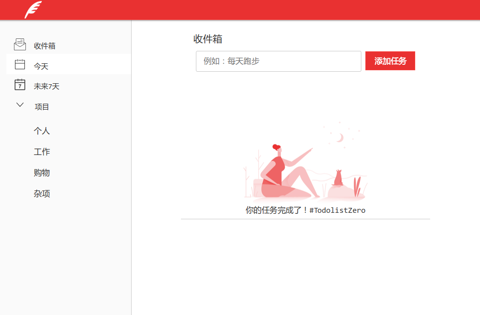

## 一个简洁的基于plain JavaScript 、indexedDB 实现的 toDoList WebAPP
[APP地址](https://hinger36.github.io/todoit)
### To Do It
通过本地数据库indexedDB实现离线存储，即使刷新关闭网页后，你添加的事务依然存在，简洁的界面不让过多的元素分散你的注意力，把注意力集中在事务本身。

响应式设计，支持PC端和移动端
#### 首页
PC端：

移动响应式设计：

*注：请确保你的浏览器支持indexedDB*

